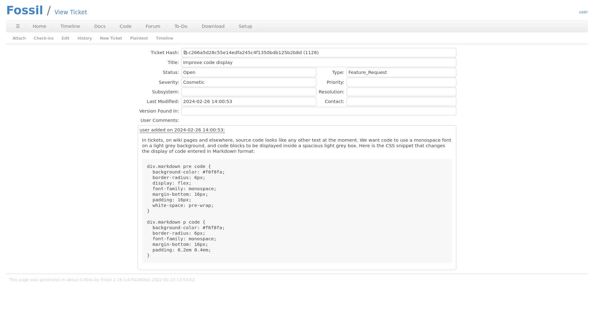
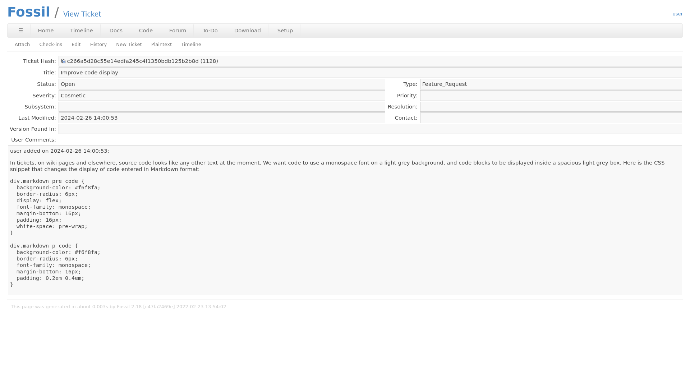

# Retouched Fossil SCM Default Skin

A CSS file that makes a few cosmetic modifications to [Fossil SCM's](https://fossil-scm.org) default skin:

- monospace font and gray background for inline code and code blocks (Markdown only)
- content block is centered
- lighter wiki edit page
- rounded table borders
- more cell spacing in tables
- more padding in user input elements

## Screenshots

For comparison, here are screenshots of the retouched default skin (left) and the built-in default skin (right).

  
  

## How to apply the modified skin

Before applying the new skin, make a backup of the skin you are currently using.

Open the file `retouched-default.css` and apply the contents following the [instructions](http://localhost:8080/setup_skin).

## Development

For development purposes this repository contains a file named `retouched-default-dev.css` which consists of the built-in default skin's CSS followed by the changes.

Submit a pull request to propose improvements.

## Author

[konstruktiv](mailto:konstruktiv@gmx.net)
